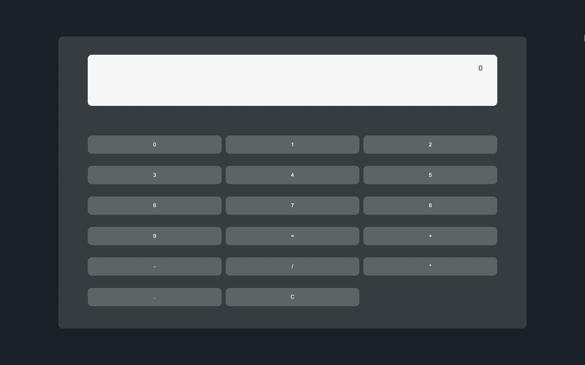

# REACT CALCULATOR

[Link to live](https://react-fcc-calculator.netlify.app/)

## THE PROJECT

This is a FCC final project to obtain the Frontend certification

## USER STORIES

This project uses a user story approach where we must meet certain requirements in order to pass

### TECH:

1. ReactJS: This project was entirely done with the React library
2. REDUX: State is being managed with REDUX

> ARYSE TANSY: FULL STACK WEB DEVELOPER
